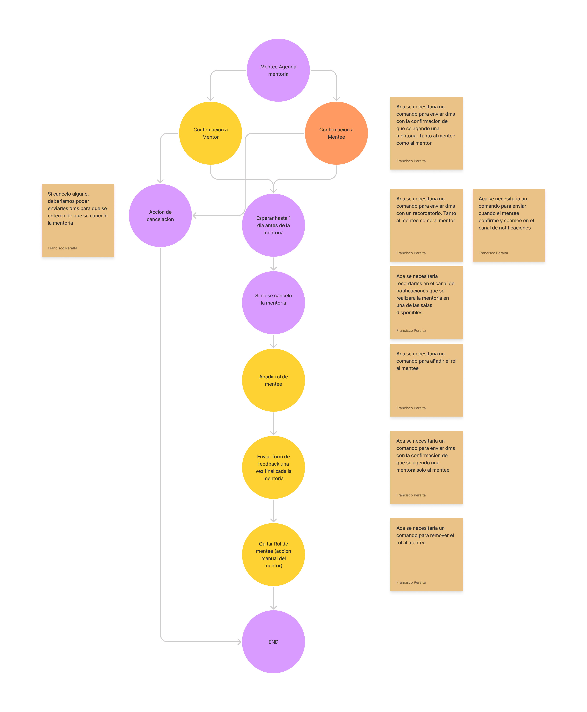

# CALOMENTOR

## Table of Contents
<!-- START doctoc generated TOC please keep comment here to allow auto update -->
<!-- DON'T EDIT THIS SECTION, INSTEAD RE-RUN doctoc TO UPDATE -->
- [Links](#links)
- [Getting Started](#getting-started)
- [Proceso al crear una mentoría](#proceso-al-crear-una-mentoría)
- [Insomnia](#insomnia)
- [Estructura del proyecto](#estructura-del-proyecto)

<!-- END doctoc generated TOC please keep comment here to allow auto update -->

API para la gestión de mentorías de FrontendCafé.

Se usa el framework [Serverless con AWS como Provider](https://www.serverless.com/framework/docs/providers/aws) y [DynamoDB](https://docs.aws.amazon.com/sdk-for-javascript/v2/developer-guide/dynamodb-example-document-client.html) como base de datos.

## Table of Contents

## Links
- [Notion](https://www.notion.so/Calomentor-989804b257604f49b7998834bfd7014f)
- [Flows](https://www.figma.com/file/vI79Z9dt9ibWwB7klmE1ha/Calomentor-Jam?node-id=0%3A1)

## Getting Started

Se necesita tener en la base del proyecto un archivo `config.dev.json` con las siguientes variables de entorno.

```
CALOMENTOR_MAIL
CALOMENTOR_MAIL_CLIENT_ID
CALOMENTOR_MAIL_CLIENT_SECRET
CALOMENTOR_MAIL_REFRESH_TOKEN
CALOMENTOR_MAIL_ACCESS_TOKEN
BASE_URL
BASE_FRONT_URL
BASE_BOT_URL
MENTORISHIP_NOTIFICATIONS_CHANNEL_ID // Por ahora para testeos va a ser la url del canal bot_test
MENTEE_ROLE_ID
JWT_KEY
API_KEY_PHRASE
API_KEY
```

Para utilizar la API, se debera añadir el siguiente header a las requests cuyo valor debe ser una API KEY

- `X-API-KEY`

Previo a ejecutar el proyecto deberemos tener instalando en nuestra computadora el framework Serverless

```bash
yarn add -g serverless
```

Luego de instalar Serverless Framework deberemos loguearnos con las credenciales de AWS

```bash
serverless config credentials --provider aws --key {{AWS_KEY}}  --secret {{AWS_SECRET_KEY}}
```

Instalar dependencias

```bash
yarn install
```

Ejecutar el server local

```bash
yarn run start-offline
```

## Proceso al crear una mentoría



## Insomnia

Todo el proyecto esta documentado con OpenAPI v3, se puede abrir la documentación desde el programa [Insomnia](https://insomnia.rest/), el archivo con la misma se encuentra en [Insomnia.json](./docs/Insomnia.json).

Al iniciar el server con `yarn run start-offline` en la terminal figura la api key que debe cargarse en el environment `Localhost`.

## Estructura del proyecto

El archivo [`./serverless.yml`](./serverless.yml) contiene todas las lambda function, cada una de las cuales refiere a una función correspondiente en [`index.ts`](./index.ts).

Cada una de las cuales a su vez refiere a una función dentro de [`services`](./services).

Cada una de estas funciones es exactamente una lambda function en AWS.